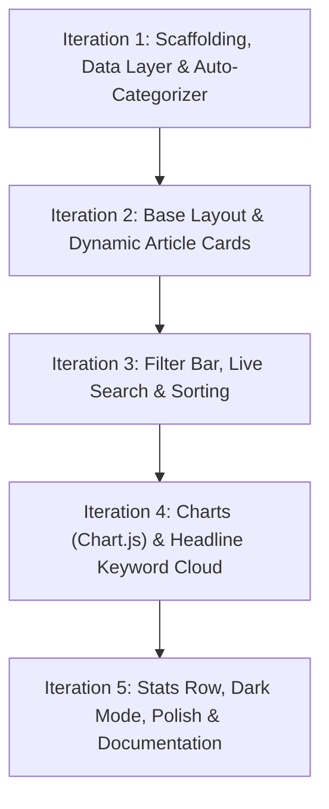

# IndoPress — Iterative Implementation Plan

Based on [indopress plan.md](file:///d:/Wengdev/IndoPress/indopress%20plan.md), this plan breaks development into progressive, manageable iterations. As requested, **we will not write the full codebase at once**. Instead, we will implement and verify one iteration at a time, checking in with you at each milestone before proceeding.

---

## Architecture & Development Strategy

- **Tech Stack**: Vanilla JavaScript (ES6+ modules), Tailwind CSS (via CDN), Chart.js (CDN), NewsAPI.
- **Offline / Rate-Limit Strategy**: NewsAPI free tier permits only 100 requests/day and enforces CORS restrictions in raw browser environments. We will build a realistic mock dataset alongside the API client so development and visual testing can proceed seamlessly without hitting API limits.
- **Progressive Delivery**: Each iteration delivers a standalone, testable piece of functionality.

---

## Roadmap of Iterations



---

### Iteration 1: Project Scaffolding, Categorizer Logic & Data Layer
**Focus**: Get the project structure in place, build the classification algorithm, and prepare the data pipeline. No complex UI yet.

- Setup file structure:
  - [NEW] `index.html` (minimal skeleton)
  - [NEW] `src/categorizer.js` (keyword classifier mapping headlines into 7 categories: Politics, Economy, Sports, Environment, Health, Diplomacy, Other)
  - [NEW] `src/mockData.js` (realistic sample articles mentioning Indonesia across all 7 categories)
  - [NEW] `src/api.js` (handles NewsAPI fetching with graceful fallback to mock data)
  - [NEW] `.gitignore`
- **Deliverable**: A runnable verification test (via Node or browser console) proving that headlines are fetched/loaded and categorized with high accuracy.

---

### Iteration 2: Base UI Layout & Dynamic Article Cards
**Focus**: Responsive layout and rendering card feeds.

- Structure layout in [index.html](file:///d:/Wengdev/IndoPress/index.html) with Tailwind CSS.
- [NEW] `src/ui.js`:
  - Render card grid with responsive columns (1 col mobile, 2–3 cols desktop).
  - Display thumbnail (with fallback image if null), headline, publisher source, formatted publication date, and category badge with distinct category styling.
- [NEW] `src/main.js`:
  - Entry point initializing data load and card rendering.
- **Deliverable**: Working visual card feed displaying categorized articles with proper link behavior (opens article in new tab).

---

### Iteration 3: Filter Bar, Live Search & Sorting
**Focus**: User interaction and dataset filtering.

- Add Category Filter chips (All, Politics, Economy, Sports, Environment, Health, Diplomacy, Other).
- Add live search input with immediate headline filtering.
- Add Sort dropdown (Latest, Oldest).
- Update [src/ui.js](file:///d:/Wengdev/IndoPress/src/ui.js) and [src/main.js](file:///d:/Wengdev/IndoPress/src/main.js) to manage filter state and dynamically update card display.
- **Deliverable**: Fully filterable and searchable article list.

---

### Iteration 4: Visualizations & Analytics (Chart.js + Keyword Cloud)
**Focus**: Data visualization components.

- Integrate Chart.js via CDN.
- [NEW] `src/charts.js`:
  - **Source Tracker**: Horizontal bar chart displaying top news outlets by article count.
  - **Topic Breakdown**: Donut chart displaying percentage distribution of categories.
- [NEW] `src/wordcloud.js`:
  - Stopword filtering and frequency counter for headline words.
  - Render top 20 keywords as styled pill badges sized by occurrence.
- **Deliverable**: Working interactive charts and keyword cloud that reflect the article data.

---

### Iteration 5: Stats Row, Dark Mode, Polish & Deployment Prep
**Focus**: UI enhancements, theme persistence, and final delivery.

- Add Quick Stats Row: Total articles count, Unique publishers count, Dominant category.
- Dark/Light mode toggle with persistence via `localStorage`.
- "Last updated" relative timestamp with manual refresh trigger.
- [NEW] `README.md` with setup guidelines, API key configuration, and deployment instructions (e.g. Vercel serverless proxy).
- Final cross-browser & responsive verification.

---

## Verification Plan

### Iteration 1 Verification
- Run categorizer against sample headlines and verify expected categorization tags in console:
  ```powershell
  node -e "import('./src/categorizer.js').then(m => console.log(m.categorizeArticle('Indonesia election results announced')))"
  ```
- Verify data structure matches NewsAPI schema.

### Subsequent Iterations
- Each iteration will have its own discrete test and visual verification step before we begin coding the next iteration.

---

## Suggested Next Step

If you approve this iterative plan, we will begin **Iteration 1 only** (scaffolding, `categorizer.js`, mock dataset, and `api.js` foundation), test it, and share the results with you before moving to Iteration 2.
